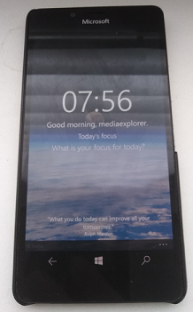

# Momentum - Daily Focus v1.12

Momentum app helps you to start your day right. 
Get inspired and set your focus for the day. 
Because only when you know your daily focus, you can reach your objectives.
Momentum will increase the chance to get your goals done.

This is my fork of Momentum app (https://github.com/b3nk4n/momentum-app)

## About 
The Daily Focus is a universal app for the Windows 10/Mobile platform (UWP).
Min. os. build: 14393

## Screenshots
<table><tr>
<td>  </td>
<td>  </td>
</tr></table>

## Abstract
It helps you to start your day right. Set your focus for the day and get inspired.
Because only when you know your daily focus, you can reach your objectives.
Daily Focus will increase the chance to get your goals done.

## Features
- Help to reach your daily goals
- Personalization
- Simple but beautiful design
- Auto synch across all your devices
- A new picture and quote every day

## Framework
This app was created and bootstrapped using my [UWPCore Framework](https://github.com/b3nk4n/uwpcore.framework).

## Credits
https://github.com/b3nk4n/ Benjamin Kan, Momentum app Developer

## License
This work is published under MIT License.

AS IS. No support. RnD mode :)

-- [m][e] 2022